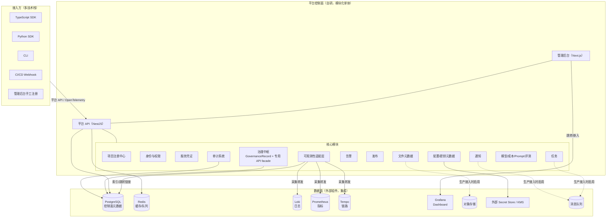

# 01 - 总体架构

> 本文描述平台的总体架构、模块边界、控制面与数据面分离、接入方式，以及自研与开源集成的边界。
> 架构决策的长期记录见 [ADR](./adr/)。

## 1. 架构总览

平台采用**模块化单体（Modular Monolith）**，控制面与数据面分离，优先集成成熟开源组件而非重造基础设施。当前本地成品闭环已经包含管理后台、平台 API、接入协议、SDK/CLI、项目注册、权限、服务凭证、审计、可观测性入口与治理中枢。

## 2. 架构原则

1. **统一控制面，而非重造基础设施**：平台重点建设项目模型、组织权限、控制面、管理后台、接入协议、SDK、CLI、数据关联、治理流程、审计。日志/指标/Trace 存储、Dashboard、消息队列、对象存储、密钥存储、时序数据库优先集成成熟组件。
2. **所有数据以项目为核心**：日志、指标、Trace、告警、配置、发布、成本、模型调用、审计数据都能关联 `project_id` / `environment` / `service_name` / `service_instance` / `version` / `owner` / `trace_id` / `request_id`。
3. **接入方不被单一技术栈锁死**：平台自身用 TypeScript，接入方支持 TS / Python 等。
4. **优先模块化单体**：第一阶段不拆微服务，但模块边界清晰，便于未来按需拆分。
5. **控制面与数据面分离**：见下文第 4 节。
6. **平台接入失败不拖垮业务**：SDK 具备超时、熔断、降级、异步上报、本地缓冲、丢弃策略、重试上限、敏感信息过滤（详见 [安全原则](./06-security-principles.md)）。
7. **安全默认开启**：最小权限、项目隔离、环境隔离、用户身份与服务身份分离、密钥不入仓库、敏感字段脱敏、审计独立。
8. **不过度设计**：所有设计必须说明当前价值和后续演进路径，不一次性设计几十个微服务或几十张无依据的数据表。

## 3. 模块边界

模块化单体按业务域划分 NestJS Module，模块间通过接口依赖注入而非直接 import 实现，保证未来可拆。下表标注每个模块的建设阶段（详见 [开发路线](./05-roadmap.md)）：

| 模块 | 当前职责 | 当前实现状态 |
|------|----------|--------------|
| 项目注册中心（Project Registry） | 项目、服务、环境、端点、manifest validate/apply、健康检查 | 已实现专用模块 |
| 身份与权限（Auth） | 本地邮箱登录、Bearer token、项目级 RBAC | 已实现专用模块 |
| 服务凭证（ServiceCredential） | 服务身份凭证签发、轮换、吊销 | 已实现于 Project Registry 安全服务 |
| 可观测性适配层（Observability） | 保存 Loki/Prometheus/Tempo/Grafana 等入口链接；原始数据留在数据面 | 已实现专用模块 |
| 治理中枢（Governance） | 告警、发布、配置/密钥、任务、功能开关、模型路由、成本、Prompt、评测控制面元数据 | 已实现 `GovernanceRecord` + 专用 API facade |
| 审计系统（Audit） | 审计事件独立存储、高风险操作记录 | 已实现专用模块 |
| Web 管理后台 | 项目目录、详情、权限、凭证、可观测性、治理总览 | 已实现 |
| CLI / SDK | 登录、manifest、项目查询、治理总览与治理记录创建 | 已实现 TypeScript / Python / CLI |
| 外部 Secret Store / 通知 / CI/CD Webhook / 对象存储 / 模型 Provider | 生产账号、凭据和真实服务接入 | 保留边界，配置型接入，不在仓库内写真实配置 |

## 4. 控制面与数据面

### 4.1 划分原则

- **控制面**：保存治理所需的元数据、关系、规则、索引、审计。要求强一致、可查询、可审计。进入 **PostgreSQL**。
- **数据面**：处理大规模、高频、时序型数据（原始日志、指标、Trace span、大文件）。由**外部组件**承载，平台不直接保存全量。

### 4.2 数据归属

| 数据类型 | 归属 | 平台角色 |
|----------|------|----------|
| 项目/服务/环境/成员/角色 | PostgreSQL（控制面） | 自研存储与查询 |
| 配置元数据、密钥元数据 | PostgreSQL（控制面） | 自研元数据；密钥真实值在外部 Store |
| 告警规则、发布记录、审计事件 | PostgreSQL（控制面） | 自研存储 |
| 原始日志 | Loki（数据面） | 平台只存 project/env/service/version 关联索引与跳转链接 |
| 指标时序 | Prometheus（数据面） | 平台只存指标定义与 Dashboard 跳转 |
| Trace span | Tempo（数据面） | 平台只存 trace_id 索引与跳转 |
| 大文件/对象 | 对象存储（数据面） | 平台封装上传/下载与权限 |
| 用量/成本明细 | 时序/聚合（数据面）+ 汇总（控制面） | 平台存聚合汇总，明细进时序库 |

### 4.3 数据关联

控制面通过统一的标签维度关联数据面数据：

- `project_id`（平台内唯一）
- `environment`（dev / staging / prod / 自定义）
- `service_name`（项目内唯一）
- `service_instance`（实例标识）
- `version`（部署版本）
- `owner`（项目负责人）
- `trace_id` / `request_id`（链路与请求标识）

所有可观测性数据在采集时由 SDK/OTel 注入这些维度，平台据此建立从控制面到数据面的跳转链接，而非复制数据。

### 4.4 查询与权限隔离

- 控制面查询走平台 API，受项目级 RBAC 控制；
- 数据面查询通过平台生成的「带权限上下文的跳转链接」或代理请求，确保用户只能看到有权限项目的可观测性数据；
- 平台不替代 Grafana 的可视化能力，而是提供带项目上下文的跳转与嵌入。

## 5. 接入方式

| 接入方式 | 职责 | 第一期必须 |
|----------|------|------------|
| `project.yaml` | 声明式项目元数据，CI/手工同步 | 是（Phase 2 校验） |
| 管理后台手工注册 | UI 录入，兜底 | 是（Phase 2） |
| 平台 API | 所有接入方式底层都走 API | 是（Phase 2） |
| TypeScript SDK | 登录、项目查询、manifest validate/apply、治理总览与治理记录创建 | 是 |
| Python SDK | 登录、项目查询、manifest validate/apply、治理总览与治理记录创建 | 是 |
| CLI | 登录、manifest 校验/apply、项目查询、治理总览、治理记录创建 | 是 |
| CI/CD Webhook | 部署事件上报 | 预留，生产接入时配置 |
| OpenTelemetry | 可观测性数据采集标准协议 | 本地数据面骨架已提供 |

详细协议见 [项目接入协议](./03-project-integration.md)。

## 6. 自研与开源集成边界

| 能力 | 自研 | 集成开源/外部 |
|------|------|----------------|
| 项目模型、权限、审计 | ✅ | — |
| 接入协议、SDK、CLI | ✅ | — |
| 管理后台、API | ✅ | — |
| 日志存储 | ❌ | Loki |
| 指标存储 | ❌ | Prometheus |
| 链路追踪 | ❌ | Tempo |
| Dashboard | ❌ | Grafana |
| 对象存储 | ❌ | S3 兼容存储 |
| 消息队列 | ❌ | 外部 MQ |
| 密钥真实存储 | ❌ | 外部 Secret Store / KMS |
| 时序数据库 | ❌ | 外部时序库 |
| OpenTelemetry 协议 | ❌ | OTel 标准 |
| 模型网关路由 | ✅（路由/降级/计量） | 模型能力由外部模型服务提供 |

## 7. 基础设施边界

- **当前本地基础设施**：Docker Compose 编排 PostgreSQL、Redis、OpenTelemetry Collector、Prometheus、Loki、Tempo、Grafana。不引入 Kubernetes。
- **未来演进**：当多环境、多集群、自动伸缩等需求真实出现时，再评估容器编排平台。在此之前，Docker Compose 或单机部署足以覆盖团队内部规模。

## 8. 架构决策记录

需要长期保留的架构决策以 ADR 形式记录，当前已建立：

- [ADR-0001 采用模块化单体](./adr/0001-modular-monolith.md)
- [ADR-0002 控制面与数据面分离](./adr/0002-control-plane-data-plane.md)
- [ADR-0003 可观测性集成而非重造](./adr/0003-observability-integration.md)
- [ADR-0004 Prisma schema 下沉到 apps/api](./adr/0004-database-schema-location.md)

## 9. 相关文档

- [愿景与产品边界](./00-vision-and-scope.md)
- [领域模型](./02-domain-model.md)
- [技术选型](./04-technology-decisions.md)
- [安全原则](./06-security-principles.md)
