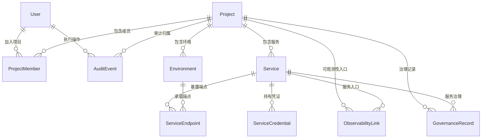

# 02 - 核心领域模型

> 本文记录当前已落地的控制面领域模型，以及仍需外部配置或后续专用化的模型边界。
> 原始日志、指标点、Trace span、大文件内容、真实密钥值、逐条模型调用明细不进入 PostgreSQL。

## 1. 当前模型总览

## 2. 实体清单

| 实体 | 当前状态 | 说明 |
|------|----------|------|
| Project | 已落库 | 项目目录核心实体 |
| Service | 已落库 | 项目内服务，支持 WEB/API/WORKER/MODEL_SERVICE 等类型 |
| Environment | 已落库 | 项目环境，如 local/dev/staging/prod/docker |
| ServiceEndpoint | 已落库 | 服务在环境中的访问地址与最近一次健康检查 |
| User | 已落库 | 本地邮箱登录用户 |
| ProjectMember | 已落库 | 项目级 RBAC 成员关系 |
| ServiceCredential | 已落库 | 服务凭证元数据与 token hash，不保存明文 token |
| AuditEvent | 已落库 | 只增审计事件，payload 统一脱敏 |
| ObservabilityLink | 已落库 | Grafana/Loki/Prometheus/Tempo 等外部数据面入口 |
| GovernanceRecord | 已落库 | 告警、发布、配置/密钥、任务、功能开关、模型、成本、Prompt/评测的统一低频控制面记录 |
| Team | 未落库 | 当前单团队模式即可满足需求，多团队出现真实需求后再引入 |
| ProjectDependency / Integration | 未落库 | 项目调用拓扑和外部集成配置，后续按真实需求专用化 |

## 3. 核心实体详述

### 3.1 Project

- **核心字段**：`id`, `slug`, `name`, `description`, `type`, `status`, `ownerName`, `ownerEmail`, `repositoryUrl`, `documentationUrl`, `tags`, `createdAt`, `updatedAt`, `archivedAt`
- **关系**：1 对多 Service / Environment / ProjectMember / ObservabilityLink / GovernanceRecord / AuditEvent
- **生命周期**：`ACTIVE` → `MAINTENANCE` → `ARCHIVED`
- **约束**：`slug` 全局唯一；命名规则见 [接入协议](./03-project-integration.md#4-命名规则)

### 3.2 Service

- **核心字段**：`id`, `projectId`, `slug`, `name`, `type`, `description`, `status`, `createdAt`, `updatedAt`, `archivedAt`
- **关系**：1 对多 ServiceEndpoint / ServiceCredential / ObservabilityLink / GovernanceRecord
- **生命周期**：`ACTIVE` → `INACTIVE` → `ARCHIVED`
- **约束**：`(projectId, slug)` 唯一

### 3.3 Environment

- **核心字段**：`id`, `projectId`, `slug`, `name`, `description`, `status`, `createdAt`, `updatedAt`, `archivedAt`
- **关系**：1 对多 ServiceEndpoint；GovernanceRecord 通过 `environmentSlug` 关联环境维度
- **生命周期**：`ACTIVE` → `INACTIVE` → `ARCHIVED`
- **约束**：`(projectId, slug)` 唯一

### 3.4 ServiceEndpoint

- **核心字段**：`id`, `serviceId`, `environmentId`, `baseUrl`, `healthCheckPath`, `healthCheckEnabled`, `lastHealthStatus`, `lastCheckedAt`, `lastLatencyMs`, `lastErrorCode`
- **关系**：属于 Service 与 Environment
- **约束**：`(serviceId, environmentId)` 唯一
- **安全边界**：健康检查受 `HEALTH_CHECK_ALLOWED_HOSTS` 限制，避免 SSRF

### 3.5 User / ProjectMember / ProjectRole

- **User 字段**：`id`, `email`, `name`, `avatarUrl`, `status`, `createdAt`, `updatedAt`, `disabledAt`
- **ProjectMember 字段**：`id`, `projectId`, `userId`, `role`, `joinedAt`, `updatedAt`
- **ProjectRole**：`OWNER` / `MAINTAINER` / `DEVELOPER` / `VIEWER`
- **约束**：`email` 全局唯一；`(projectId, userId)` 唯一

### 3.6 ServiceCredential

- **核心字段**：`id`, `serviceId`, `environmentSlug`, `name`, `tokenHash`, `status`, `issuedAt`, `rotatedAt`, `revokedAt`, `expiresAt`, `createdByUserId`
- **关系**：属于 Service
- **生命周期**：签发 → `ACTIVE` → `ROTATED` / `REVOKED`
- **约束**：只保存 token hash；明文 token 只在签发/轮换响应中返回一次

### 3.7 AuditEvent

- **核心字段**：`id`, `actorType`, `actorId`, `action`, `targetType`, `targetId`, `projectId`, `payload`, `ip`, `createdAt`
- **关系**：可选关联 User 与 Project
- **约束**：只增不改；payload 必须脱敏；高风险写操作必须记录

### 3.8 ObservabilityLink

- **核心字段**：`id`, `projectId`, `serviceId`, `environmentSlug`, `signal`, `title`, `url`, `createdAt`, `updatedAt`
- **signal**：`LOGS` / `METRICS` / `TRACES` / `DASHBOARD`
- **边界**：只保存外部入口和项目维度，不复制原始日志、指标或 Trace

### 3.9 GovernanceRecord

- **核心字段**：`id`, `projectId`, `serviceId`, `environmentSlug`, `kind`, `name`, `status`, `data`, `createdAt`, `updatedAt`
- **kind**：`ALERT_RULE`, `ALERT_EVENT`, `CONFIGURATION`, `SECRET_METADATA`, `DEPLOYMENT`, `TASK`, `FILE_OBJECT`, `NOTIFICATION`, `FEATURE_FLAG`, `MODEL_ROUTE`, `USAGE_RECORD`, `COST_RECORD`, `PROMPT_VERSION`, `EVALUATION_RUN`
- **API**：既支持通用 `/projects/:slug/governance-records`，也支持告警、发布、配置/密钥、成本、模型、Prompt/评测的专用 facade
- **边界**：适合低频控制面元数据；高频明细和真实密钥值进入外部数据面或 Secret Store

## 4. 专用化边界

当前治理中枢先用 GovernanceRecord 统一承载低频记录，避免提前为每个治理域建表。以下情况出现时，再拆专用表和专用模块：

- 某个 `kind` 的查询量、字段结构或状态流转明显复杂化；
- 需要跨项目聚合趋势、配额计算或严格约束；
- 需要独立权限边界、独立生命周期或高频写入；
- 需要接入外部系统的双向同步。

## 5. 不机械建表的原则

1. 明细型高频数据不进控制面：原始日志、指标点、Trace span、逐条模型调用明细进数据面。
2. 真实密钥不进数据库：只保存外部引用和治理元数据。
3. 审计独立：AuditEvent 保持只增不改，避免被业务表生命周期影响。
4. 单一消费者不提 package：当前 Prisma schema 只归属 API，位置见 [ADR-0004](./adr/0004-database-schema-location.md)。

## 6. 相关文档

- [总体架构](./01-architecture.md)
- [项目接入协议](./03-project-integration.md)
- [开发路线](./05-roadmap.md)
- [分阶段技术方案](./09-phased-technical-plan.md)
