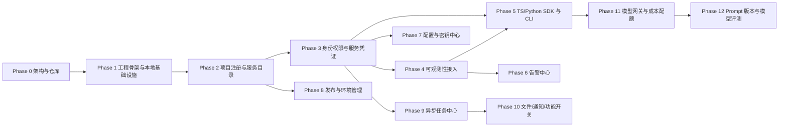

# 05 - 开发路线

> 本文给出平台分阶段建设的可执行路线，每个阶段写明目标、前置条件、交付物、验收标准、不做什么与主要风险。
> **每次只执行一个 Phase，不得跨阶段开发。**

## 阶段依赖总览

## Phase 0：架构与仓库初始化（已完成）

- **目标**：完成仓库初始化、需求梳理、总体架构与路线规划。
- **前置条件**：无。
- **核心交付物**：Git 仓库、README、CLAUDE.md、docs 目录与架构文档、ADR。
- **验收标准**：文档一致、无敏感信息、已提交并推送。
- **不做什么**：不初始化工程骨架、不写业务代码、不部署服务。
- **主要风险**：范围理解偏差 → 通过明确边界文档控制。

## Phase 1：工程骨架与本地基础设施（已完成）

- **目标**：建立 monorepo 骨架，本地起 PostgreSQL / Redis，提供真实可运行的管理后台与 API。
- **前置条件**：Phase 0 完成。
- **核心交付物**：pnpm workspace + Turborepo 结构、NestJS API（健康检查/版本/请求 ID/结构化日志/配置校验/OpenAPI/CORS/优雅关闭/PG/Redis 连接）、Next.js 管理后台（真实状态展示 + 降级）、Prisma 7 driver adapter 基础、Docker Compose（仅 PG+Redis）、GitHub Actions CI、单元 + 集成 + Playwright E2E 测试。
- **验收标准**：`docker compose up` 起基础设施；API 与 Web 可启动；live/ready/version 真实工作；依赖失败正确降级；lint/typecheck/test/integration/build/E2E 全通过；CI workflow 已创建。
- **不做什么**：不实现业务模块、不做登录、不做可观测性组件（Loki/Prometheus/Tempo/Grafana 在 Phase 4）。
- **主要风险**：依赖版本选择不当 → 已通过官方文档验证锁定；本机已安装的 PG/Redis 占用 5432/6379 → Docker 宿主端口改用 5433/6380 避开冲突。

## Phase 1.5：系统级目录架构审计与收敛（规划中，待启动）

- **目标**：审计 Phase 1 产生的目录结构、空包、重复配置、依赖方向，做收敛调整。
- **前置条件**：Phase 1 完成。
- **核心交付物**：目录结构收敛方案与实施（由用户单独下发指令启动）。
- **不做什么**：不进入 Phase 2 业务开发。

## Phase 2：项目注册与服务目录

- **目标**：实现项目、服务、环境、成员的注册与查询，管理后台可见服务目录。
- **前置条件**：Phase 1。
- **核心交付物**：Project/Service/Environment/ProjectMember 模块与 API、`project.yaml` 校验、管理后台项目列表与详情页。
- **验收标准**：可手工注册项目，可查看所有项目负责人/环境/健康占位。
- **不做什么**：不做鉴权（先用最简保护）、不做可观测性数据接入。
- **主要风险**：模型设计过度 → 只实现核心字段。

## Phase 3：身份、权限与服务凭证

- **目标**：统一用户认证、项目级 RBAC、服务身份凭证签发/轮换/吊销、审计事件。
- **前置条件**：Phase 2。
- **核心交付物**：Auth 模块、ProjectRole 权限、ServiceCredential 模块、AuditEvent 独立存储。
- **验收标准**：用户登录、项目角色生效、服务凭证可签发与吊销、关键操作有审计。
- **不做什么**：不做复杂 ABAC、不做 SSO 全量集成（先留接口）。
- **主要风险**：权限模型过度复杂 → 先 RBAC，按需扩展。

## Phase 4：可观测性接入

- **目标**：通过 OpenTelemetry 接收日志/指标/trace，关联项目维度，提供跳转。
- **前置条件**：Phase 3（凭证）、Phase 1（可观测性组件）。
- **核心交付物**：Observability 适配层、维度关联、Grafana 跳转/嵌入、HealthCheck。
- **验收标准**：接入方上报数据可在平台按项目/环境/服务查看入口并跳转 Grafana。
- **不做什么**：不自建存储、不复制全量数据。
- **主要风险**：指标维度爆炸 → 约束 label 基数。

## Phase 5：TypeScript/Python SDK 与 CLI

- **目标**：标准化接入，SDK 封装运行时能力，CLI 提供管理操作。
- **前置条件**：Phase 4、Phase 3。
- **核心交付物**：sdk-ts、sdk-python、CLI（注册/校验/查询/轮换）。
- **验收标准**：SDK 可上报可观测性数据并具备故障隔离；CLI 可完成核心管理操作。
- **不做什么**：不实现所有模块能力，只覆盖已上线模块。
- **主要风险**：SDK 强侵入 → 提供降级开关与渐进接入。

## Phase 6：告警中心

- **目标**：告警规则、告警事件、通知分发。
- **前置条件**：Phase 4。
- **核心交付物**：AlertRule/AlertEvent 模块、基于 Prometheus 的评估、通知分发。
- **验收标准**：可配置规则并触发告警事件与通知。
- **不做什么**：不做复杂事件关联引擎。
- **主要风险**：告警风暴 → 分级与抑制策略。

## Phase 7：配置与密钥中心

- **目标**：配置版本管理、密钥元数据与外部 Store 对接。
- **前置条件**：Phase 3。
- **核心交付物**：Configuration 版本化、SecretMetadata、外部 Store 适配。
- **验收标准**：配置可版本化回滚；密钥引用可轮换且不入库真实值。
- **不做什么**：不自建加密存储。
- **主要风险**：密钥泄露 → 元数据层 + 外部 Store + 审计。

## Phase 8：发布与环境管理

- **目标**：部署记录、版本、环境配置、CI/CD Webhook。
- **前置条件**：Phase 2。
- **核心交付物**：Deployment 模块、Webhook 接收、版本与环境视图。
- **验收标准**：部署事件可上报并关联服务/环境/版本。
- **不做什么**：不执行部署、不替代 CI/CD。
- **主要风险**：与外部 CI/CD 耦合 → 只接收事件。

## Phase 9：异步任务中心

- **目标**：异步任务定义、调度、状态追踪。
- **前置条件**：Phase 3、Phase 1（MQ）。
- **核心交付物**：Task 模块、基于外部 MQ 的调度、状态追踪。
- **验收标准**：可定义并追踪任务执行状态。
- **不做什么**：不自建 MQ、不做复杂工作流引擎。
- **主要风险**：任务积压 → 监控与丢弃策略。

## Phase 10：文件、通知、功能开关

- **目标**：对象存储封装、多渠道通知、功能开关。
- **前置条件**：Phase 9。
- **核心交付物**：File 模块、Notification 模块、FeatureFlag 模块。
- **验收标准**：可上传/下载文件、发送通知、控制开关。
- **不做什么**：不自建对象存储。
- **主要风险**：文件权限越权 → 项目级隔离。

## Phase 11：模型网关与成本配额

- **目标**：统一模型调用入口、路由降级、用量记录、成本统计、配额限流。
- **前置条件**：Phase 5。
- **核心交付物**：ModelGateway 模块、UsageRecord/CostRecord 聚合、配额与熔断。
- **验收标准**：模型调用经网关，用量与成本可统计，超额可限流。
- **不做什么**：不自研模型、不存全量调用明细（进时序库）。
- **主要风险**：模型成本失控 → 配额 + 熔断 + 预警。

## Phase 12：Prompt 版本与模型评测

- **目标**：Prompt 版本管理、模型评测。
- **前置条件**：Phase 11。
- **核心交付物**：PromptVersion 模块、评测流程。
- **验收标准**：Prompt 可版本化，评测可对比。
- **不做什么**：不做通用 MLOps 平台。
- **主要风险**：评测标准主观 → 提供可配置评测维度。

## 相关文档

- [总体架构](./01-architecture.md)
- [领域模型](./02-domain-model.md)
- [风险分析](./07-risks.md)
