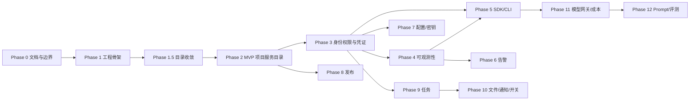

# 09 - 分阶段技术方案

> 本文基于当前仓库真实状态，定义 team-platform 从最小 MVP 到最终形态的分阶段开发方案。
> 它补充 [开发路线](./05-roadmap.md)：路线图说明阶段目标，本文说明每阶段的技术落地边界。

## 1. 最终形态

team-platform 最终要做成一个面向团队多项目治理的通用内部平台。平台自身使用 TypeScript / NestJS / Next.js 实现，但接入项目不绑定平台技术栈，应通过 `project.yaml`、平台 API、CLI、SDK、Webhook 与 OpenTelemetry 支持 TypeScript、Python 以及未来其他语言项目接入。

最终产品由四部分组成：

1. **管理后台**：给平台管理员、项目负责人、项目成员使用，查看项目目录、服务、环境、健康状态、告警、发布、配置、成本等信息。
2. **平台 API**：管理后台、CLI、SDK、CI/CD Webhook 的统一后端，承载项目注册、权限、服务凭证、配置元数据、审计等控制面能力。
3. **接入协议**：通过 `project.yaml`、SDK、CLI、Webhook、OpenTelemetry 让不同技术栈项目低侵入接入平台。
4. **治理中枢**：把项目负责人、服务目录、可观测性入口、配置/密钥元数据、告警、发布记录、模型调用与成本治理收口到统一控制面。

## 2. 当前真实状态

截至 2026-06-27，本仓库已具备：

- pnpm workspace + Turborepo monorepo；
- NestJS API，已接入配置校验、结构化日志、请求 ID、异常过滤、Prisma、Redis、健康检查、版本接口；
- `auth`、`audit`、`project-registry`、`observability`、`governance` 后端模块；
- Next.js 统一平台入口，支持登录、项目目录、服务、环境、端点、成员、凭证、可观测性链接、治理中枢总览；
- 管理后台同源 API 代理 `/api/platform/*`，浏览器侧只需要访问一个平台页面；
- PostgreSQL、Redis、OpenTelemetry Collector、Prometheus、Loki、Tempo、Grafana 本地 Docker Compose；
- `packages/contracts`、`packages/config`、`packages/logger` 三个共享包；
- TypeScript SDK、Python SDK、CLI；
- 单元测试、API 集成测试、Playwright E2E 测试结构；
- 架构、领域模型、接入协议、路线图、安全原则、风险与 ADR 文档。
- `pnpm platform:start` / `pnpm platform:stop` 本地总平台启动脚本，默认 Web 入口为 `http://localhost:3004`，API 上游为 `http://localhost:3005`。

当前已经形成最小可用闭环：

- Project Registry 专用业务 API 和管理后台；
- `project.yaml` / JSON manifest 校验与幂等 apply；
- 本地邮箱登录、Bearer token、项目级 RBAC、服务凭证、审计；
- 可观测性入口与本地数据面编排骨架；
- 多语言接入的 TS/Python SDK 与 CLI；
- Phase 6-12 的告警、配置/密钥、发布、任务、文件/通知/功能开关、模型网关/成本、Prompt/评测以 `GovernanceRecord` 统一控制面承载，并提供专用治理 API、CLI/SDK 调用和管理后台治理总览；
- `examples/project-manifests/manjv-studio.yaml` 与 `/Users/xuegang/Desktop/My Project/manjv-studio/project.yaml` 已作为真实项目接入样例。

仍需外部配置才能启用的生产集成：

- SSO、外部 Secret Store、真实通知渠道、CI/CD Webhook、对象存储、模型 Provider 的账号、凭据和生产地址；
- 高频治理域后续可按真实使用频率从 `GovernanceRecord` 拆成专用表和专用模块；
- 生产部署、域名、证书、备份、监控告警接收人等环境配置。

## 3. 开发原则

1. **先做可用控制面，再做高级治理**：MVP 先解决“项目在哪里、谁负责、有哪些服务、运行在哪些环境、健康如何”。
2. **默认按阶段推进**：常规开发一个阶段完成验收后再进入下一阶段；当明确要求连续推进时，每阶段仍要保留独立边界和验收记录。
3. **控制面与数据面分离**：PostgreSQL 存治理元数据、关系、规则、索引、审计；日志、指标、Trace、大文件等高频数据进入外部组件。
4. **多语言接入靠协议，不靠代码耦合**：项目元数据先用 manifest/API 接入；运行时能力后续由 TS/Python SDK 与 OTel 实现。
5. **不提前创建空模块**：只有进入对应阶段才新增业务模块、package、app 或基础设施配置。
6. **安全默认约束**：不保存真实密钥，不把 Token/密码写入 manifest、数据库或日志；所有高风险操作最终必须可审计。
7. **验证必须真实执行**：每阶段结束只报告实际跑过的 lint/typecheck/test/build/integration/E2E。

## 4. MVP 定义

最小 MVP 不是完整治理平台，而是一个可内部试用的项目服务目录：

- 可通过 API 注册项目、服务、环境、服务端点；
- 可通过管理后台查看项目列表与项目详情；
- 可记录项目负责人、仓库地址、文档地址、标签、服务类型、环境、端点；
- 可对配置了健康检查的端点执行受控探测，并在项目详情中显示最近一次健康状态；
- 可校验并应用 `project.yaml`，让 TS、Python 或其他语言项目都能以同一声明式协议接入；
- 无完整登录和 RBAC，但需要有最小管理保护，避免本地以外环境裸奔。

MVP 明确不做：

- 不做完整用户体系、项目级 RBAC、SSO；
- 不接入 Loki / Prometheus / Tempo / Grafana；
- 不提供 TS/Python SDK；
- 不做告警、配置中心、密钥中心、发布管理、任务中心、文件服务、模型网关；
- 不伪造业务数据，不用静态页面冒充真实功能。

## 5. 分阶段方案

### Phase 0：架构与仓库初始化（已完成）

**目标**：明确愿景、边界、架构和阶段路线。

**技术交付**：

- README、CLAUDE.md、docs、ADR；
- 总体架构、领域模型、接入协议、技术选型、安全原则、风险分析。

**验收**：

- 文档之间没有明显矛盾；
- 没有写入密钥、Token、真实生产地址；
- 后续阶段能从文档中找到边界依据。

### Phase 1：工程骨架与本地基础设施（已完成）

**目标**：建立可运行的 API + Web + PostgreSQL + Redis 基础。

**技术交付**：

- `apps/api`：NestJS、配置校验、结构化日志、请求 ID、异常过滤、OpenAPI、健康检查、版本接口、Prisma、Redis；
- `apps/web`：Next.js 状态看板；
- `packages/contracts`：健康检查、版本、错误响应等共享契约；
- `packages/config`：API/Web 环境变量校验；
- `packages/logger`：日志脱敏路径；
- `compose.yaml`：本地 PostgreSQL + Redis；
- 单元、集成、E2E 测试入口。

**验收**：

- `pnpm dev:infra` 可启动 PostgreSQL / Redis；
- API `/health/live`、`/health/ready`、`/version` 真实可用；
- Web 可展示真实依赖状态；
- lint、typecheck、unit、integration、build、E2E 在对应环境通过。

### Phase 1.5：目录架构审计与收敛（已完成）

**目标**：收敛 Phase 1 产生的目录、依赖方向和空包问题。

**技术交付**：

- Prisma schema 下沉到 `apps/api/prisma`；
- 删除无真实消费者的 database package；
- 明确 `apps/*` 与 `packages/*` 依赖方向；
- 建立 [仓库架构](./08-repository-architecture.md)。

**验收**：

- 目录结构与文档一致；
- 没有空 app、空 package、空业务模块；
- 验证链路重新通过。

### Phase 2：MVP 项目注册与服务目录（已完成）

**目标**：完成最小 MVP，让平台真正能管理团队项目目录。

**后端模块**：

- 新增 `apps/api/src/project-registry/`；
- 按业务域拆分 `ProjectRegistryModule`、controller、service、repository/mapper、DTO validation；
- 使用现有 Prisma schema：`Project`、`Service`、`Environment`、`ServiceEndpoint`；
- 所有写操作使用事务维护项目、服务、环境、端点关系；
- 软归档项目/服务/环境，不做物理删除；
- 统一使用 `BusinessException` 与 contracts 中的错误码。

**API 范围**：

- `GET /projects`：分页、搜索、按状态/类型/负责人/标签过滤；
- `POST /projects`：创建项目；
- `GET /projects/:slug`：项目详情，包含服务、环境、端点；
- `PATCH /projects/:slug`：更新核心元数据；
- `POST /projects/:slug/archive`：归档项目；
- `POST /projects/:slug/services`、`PATCH /projects/:slug/services/:serviceSlug`；
- `POST /projects/:slug/environments`、`PATCH /projects/:slug/environments/:environmentSlug`；
- `POST /projects/:slug/endpoints`、`PATCH /projects/:slug/endpoints/:endpointId`；
- `POST /project-manifests/validate`：校验 manifest；
- `POST /project-manifests/apply`：幂等应用 manifest。

**Manifest 范围**：

- 采用 `apiVersion: team-platform.io/v1alpha1`、`kind: Project`；
- 校验 slug、枚举、必填字段、服务/环境/端点引用关系；
- 将 labels 规范化为 tags；
- 扫描疑似密钥、Token、含密码连接串；
- apply 必须幂等：已存在则更新，缺失则创建，不自动删除未声明资源。

**健康检查范围**：

- endpoint 可配置 `healthCheckEnabled` 与 `healthCheckPath`；
- 提供手动触发探测 API，写回 `lastHealthStatus`、`lastCheckedAt`、`lastLatencyMs`、`lastErrorCode`；
- 通过 `HEALTH_CHECK_ALLOWED_HOSTS` 限制可探测主机；
- 默认不探测内网/任意地址，避免 SSRF 风险；
- 不做周期调度，周期探测放到后续任务中心或可观测性阶段。

**前端范围**：

- 首页从纯状态看板升级为管理后台入口；
- 新增项目列表页：搜索、筛选、分页、状态展示；
- 新增项目详情页：基础信息、服务、环境、端点、最近健康状态；
- 新增创建/编辑表单：项目、服务、环境、端点；
- 新增 manifest 校验/apply 页面或表单；
- 保留系统健康状态入口。

**最小保护**：

- 本地开发可关闭；
- 非 development 环境必须配置管理 API token 或等价的临时保护；
- 该保护不是最终 Auth/RBAC，不在 UI 中伪装成完整登录系统。

**测试与验证**：

- API 单元测试：mapper、validation、manifest parser、错误映射；
- API 集成测试：CRUD、分页筛选、唯一约束、软归档、manifest validate/apply、健康检查 host allowlist；
- Web 单元测试：列表、详情、表单状态；
- E2E：创建项目、查看详情、应用 manifest、刷新健康状态；
- 必跑：`pnpm lint`、`pnpm typecheck`、`pnpm test`、`pnpm test:integration`、`pnpm build`，可运行环境下跑 `pnpm test:e2e`。

**MVP 验收**：

- 能注册 `team-platform` 自身；
- 能注册至少一个 TypeScript 项目和一个 Python 项目的 manifest 示例；
- 管理后台能看到项目、服务、环境、端点和最近健康状态；
- API 返回结构与 `packages/contracts` 一致；
- 没有真实密钥入库、入日志或进入 manifest。

**不做**：

- 不做完整登录/RBAC；
- 不做服务凭证；
- 不做可观测性数据面；
- 不做 SDK/CLI；
- 不做告警、配置、发布、成本。

### Phase 3：身份、权限、服务凭证与审计（已完成）

**目标**：让平台从“目录工具”变成“可控治理系统”。

**后端模块**：

- `auth`：用户登录、会话或 Token 校验；
- `project-access`：项目级 RBAC；
- `service-credential`：服务身份凭证签发、轮换、吊销；
- `audit`：高风险操作审计。

**数据模型**：

- `User`、`ProjectMember`、`ProjectRole`；
- `ServiceCredential` 只保存哈希、状态、过期时间、外部 secret 引用，不保存明文；
- `AuditEvent` 独立只增不改，payload 必须脱敏。

**前端范围**：

- 登录/退出；
- 当前用户、项目角色展示；
- 项目成员管理；
- 服务凭证管理；
- 审计事件查看。

**验收**：

- 用户只能访问有权限的项目；
- owner/maintainer/developer/viewer 权限边界生效；
- 服务凭证可签发、轮换、吊销；
- 项目归档、成员变更、凭证操作等写入审计。

### Phase 4：可观测性接入（已完成）

**目标**：让项目运行数据能按项目、服务、环境关联并跳转查看。

**基础设施**：

- Docker Compose 增加 OTel Collector、Loki、Prometheus、Tempo、Grafana；
- 不把这些组件封装成平台自研存储。

**后端模块**：

- `observability`：保存数据面连接配置、Dashboard 链接、指标定义与 trace/log 跳转参数；
- endpoint 健康检查可继续轻量落库；
- 原始日志、指标点、span 不进入 PostgreSQL。

**接入方式**：

- 标准 OpenTelemetry；
- 统一注入 `project_id`、`environment`、`service_name`、`version`、`trace_id`、`request_id`。

**前端范围**：

- 项目详情增加日志、指标、Trace、Dashboard 跳转；
- 展示最近健康状态与可观测性接入状态。

**验收**：

- 接入示例项目后，可从项目详情跳转到对应 Grafana/Loki/Tempo/Prometheus 视图；
- 用户权限上下文不被绕过；
- PostgreSQL 不保存原始高频可观测性数据。

### Phase 5：TypeScript / Python SDK 与 CLI（已完成）

**目标**：降低多语言项目接入成本。

**新增包/应用**：

- `packages/sdk-ts`：TypeScript SDK；
- `packages/sdk-python` 或独立 Python 包目录：Python SDK；
- `apps/cli` 或 `packages/cli`：根据真实发布方式决定，只创建可运行 CLI。

**当前 SDK 范围**：

- 显式配置平台 API 地址与 Bearer token；
- 调用登录、项目列表、manifest validate/apply、治理总览与治理记录创建；
- 支持请求超时；
- Python SDK 使用标准库实现，避免引入额外运行时依赖。

**CLI 范围**：

- `login`：本地邮箱登录；
- `validate`：校验 `project.yaml`；
- `apply`：应用 manifest；
- `projects list`：查询可访问项目；
- `governance dashboard`：查看项目治理总览；
- `governance create`：创建告警、发布、配置/密钥、成本、模型、Prompt/评测等治理记录，支持服务与环境维度；
- 后续在专用模块成熟后补齐 credentials、releases 的专用子命令。

**验收**：

- TS 与 Python 示例项目都能通过统一 manifest 接入；
- 平台不可用时 SDK 不阻断业务主流程；
- CLI 可在 CI 中使用并返回明确退出码。

### Phase 6-12：治理中枢控制面（已完成本地完整闭环）

Phase 6-12 当前用 `GovernanceRecord` 统一控制面承载低频治理元数据，同时提供专用 API facade 和管理后台治理总览。这样可以先满足团队项目治理中“有记录、有关联、有权限、有审计、可按项目/服务/环境查看”的共同需求，再根据真实使用频率拆分专用模型。

**统一模型**：

- `GovernanceRecord` 归属 Project，可选关联 Service / Environment；
- `kind` 覆盖 `ALERT_RULE`、`ALERT_EVENT`、`CONFIGURATION`、`SECRET_METADATA`、`DEPLOYMENT`、`TASK`、`FILE_OBJECT`、`NOTIFICATION`、`FEATURE_FLAG`、`MODEL_ROUTE`、`USAGE_RECORD`、`COST_RECORD`、`PROMPT_VERSION`、`EVALUATION_RUN`；
- `name`、`status`、`environmentSlug`、`serviceId`、`data`、时间字段保存控制面元数据；
- 写操作受项目 RBAC 保护并写入审计。

**API / UI**：

- `GET /projects/:slug/governance-records`；
- `POST /projects/:slug/governance-records`；
- `PATCH /projects/:slug/governance-records/:recordId`；
- `GET /projects/:slug/governance-dashboard`；
- `POST /projects/:slug/alerts/rules`、`POST /projects/:slug/alerts/events`；
- `POST /projects/:slug/deployments`、`POST /projects/:slug/configurations`、`POST /projects/:slug/secret-references`；
- `POST /projects/:slug/cost-records`、`POST /projects/:slug/model-routes`、`POST /projects/:slug/prompt-versions`、`POST /projects/:slug/evaluation-runs`；
- 管理后台在项目详情中提供治理总览、分类列表和关键汇总指标。

**适用边界**：

- 适合规则、事件、外部链接、版本、配置元数据、成本聚合等低频控制面数据；
- 不适合日志明细、指标点、trace span、大文件内容、真实密钥值、模型调用逐条明细；
- 数据量或业务规则增长后，把高频 `kind` 拆成专用表和专用模块。

### Phase 6：告警中心（由 GovernanceRecord 支撑最小闭环）

**目标**：把可观测性结果转为可追踪的告警规则和告警事件。

**后端模块**：

- `alert`：AlertRule、AlertEvent；
- 基于 Prometheus 查询或外部 Alertmanager Webhook；
- 告警抑制、分级、状态流转。

**前端范围**：

- 告警规则列表与编辑；
- 告警事件列表、详情、确认、解决；
- 项目详情显示活跃告警。

**验收**：

- 可配置规则并触发事件；
- 告警与项目/环境/服务关联；
- 通知失败不影响业务服务。

### Phase 7：配置与密钥中心（由 GovernanceRecord 支撑最小闭环）

**目标**：统一配置版本管理和密钥元数据治理。

**后端模块**：

- `configuration`：配置 key、环境、版本、schema、发布状态；
- `secret-metadata`：密钥名称、外部引用、轮换策略、最近轮换时间；
- 外部 Secret Store / KMS adapter。

**边界**：

- 真实密钥值不入库；
- 平台只存元数据和外部引用；
- 读取真实密钥必须通过外部 Store 权限控制。

**验收**：

- 配置可版本化、对比、回滚；
- 密钥可登记、轮换、审计；
- 日志、错误响应、审计 payload 不泄露真实密钥。

### Phase 8：发布与环境管理（由 GovernanceRecord 支撑最小闭环）

**目标**：记录项目发布事件和环境状态，但不替代 CI/CD。

**后端模块**：

- `release`：Deployment、版本、commit、环境、状态；
- CI/CD Webhook 接收；
- 与 Project / Service / Environment 关联。

**前端范围**：

- 项目发布时间线；
- 环境当前版本；
- 失败发布详情与外部 CI 链接。

**验收**：

- 外部 CI/CD 可上报发布事件；
- 平台可查询每个服务在每个环境的当前版本；
- 平台不执行部署。

### Phase 9：异步任务中心（由 GovernanceRecord 支撑最小闭环）

**目标**：承载平台内部异步任务，不做通用工作流引擎。

**基础设施**：

- 继续使用 Redis 或引入外部 MQ，按真实需求决定；
- 不自研消息队列。

**任务范围**：

- endpoint 周期健康检查；
- manifest 批量同步；
- 可观测性链接刷新；
- 通知发送；
- 低优先级统计聚合。

**验收**：

- 任务可排队、执行、失败重试、超限丢弃；
- 任务状态可查询；
- 任务积压不会拖垮 API。

### Phase 10：文件、通知、功能开关（由 GovernanceRecord 支撑最小闭环）

**目标**：补齐项目治理常用横向能力。

**文件服务**：

- 对象存储 adapter；
- 文件元数据、权限、下载链接；
- 不自建对象存储。

**通知中心**：

- 邮件、Slack/Webhook 等渠道；
- 通知模板、重试、失败记录。

**功能开关**：

- 项目级 flag；
- 环境隔离；
- 简单规则评估；
- SDK 侧缓存和降级。

**验收**：

- 文件访问受项目权限约束；
- 告警/任务/发布可复用通知中心；
- 功能开关可按项目和环境读取。

### Phase 11：模型网关与成本配额（由 GovernanceRecord 支撑最小闭环）

**目标**：统一团队模型调用入口，控制成本和风险。

**后端模块**：

- `model-gateway`：模型 provider、route、fallback、timeout；
- `usage`：调用聚合；
- `cost`：成本统计；
- `quota`：项目/服务/用户维度配额。

**边界**：

- 不自研模型；
- 不把逐条大规模调用明细长期放 PostgreSQL；
- PostgreSQL 存聚合和治理状态，明细进入时序/日志数据面。

**验收**：

- 模型调用可按项目计量；
- 超额可限流或降级；
- 管理后台可看成本趋势和配额使用。

### Phase 12：Prompt 版本与模型评测（由 GovernanceRecord 支撑最小闭环）

**目标**：在模型网关基础上管理 prompt 版本和评测结果。

**后端模块**：

- `prompt-version`：prompt 元数据、版本、状态、关联项目；
- `evaluation`：评测集、评测任务、结果摘要；
- 内容大对象可放对象存储，控制面保存引用。

**前端范围**：

- Prompt 版本列表、对比、发布状态；
- 评测任务结果和趋势。

**验收**：

- Prompt 可版本化；
- 评测结果可追踪；
- 可关联模型调用、成本和项目归属。

## 6. 阶段依赖关系

## 7. 每阶段完成定义

每个阶段必须同时满足：

- 代码、数据库 schema、contracts、Web UI、测试、文档同步；
- 新增 API 有集成测试；
- 新增 UI 有单元测试或 E2E 覆盖核心路径；
- 新增数据库表有迁移；
- 新增环境变量写入 `.env.example` 并通过 zod 校验；
- 错误响应使用统一错误结构，不泄露堆栈、连接串、密钥；
- 执行并记录与改动范围匹配的验证命令；
- 默认完成后停止，不自动进入下一阶段；连续开发模式下必须完成本阶段验收记录后再推进。

## 8. 外部集成收敛

当前代码层面的本地成品闭环已完成。后续进入生产环境前，需要在外部系统侧补齐配置：

- 基于真实团队使用频率，把高价值 `GovernanceRecord.kind` 拆成专用表和专用模块；
- 接入 SSO、外部 Secret Store、真实通知渠道、CI/CD Webhook、对象存储与模型 Provider；
- 为 SDK 增加可观测性运行时封装、配置只读、功能开关缓存、故障降级等能力；
- 配置生产域名、证书、备份、监控告警接收人、数据保留周期和审计归档策略。
